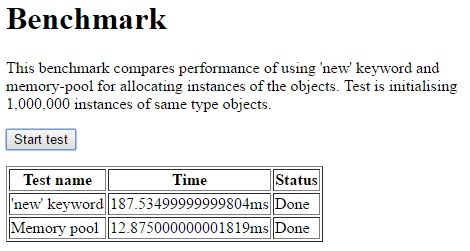
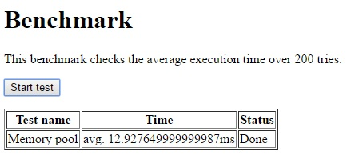

# memory-pool
[](https://travis-ci.org/tmikus/memory-pool)
[](https://david-dm.org/tmikus/memory-pool)
[](https://david-dm.org/tmikus/memory-pool#info=devDependencies)

## Introduction

This library implements a very fast memory pool. It can be used in game engines for the purpose of storing
multiple objects of the same type.

Here are benchmark results collected on Google Chrome 50.0.2661.102 m (64-bit) running
on Windows 10 and Intel i7-3930K@3.2GHz. Source code of the benchmark is available here:
[benchmark/001-comparison/index.html](benchmark/001-comparison/index.html) and [benchmark/002-average-time/index.html](benchmark/002-average-time/index.html)





## Installation

```bash
npm install memory-pool
```

## Usage - web browser

Before you start using this library simply include the `node_modules/memory-pool/dist/memory-pool.js` file on your website.
It's recommended to include this file in your assets pipeline and concatenate it with the rest of your javascript files.

## Usage - Node.js

To include the memory pool within Node.js app simply load the module.

```javascript
var MemoryPool = require("memory-pool");
```

## Creating memory pool

The following example creates a homogeneous memory pool. `objectFactory` function creates
a new EMPTY instance of the object to store in the memory. Memory gets filled with
the specified amount of elements of the same type. In this example it's 1024 objects of
a type `foo`. It's REALLY important to add `memoryAddress` property to the object.
It's necessary for allocation and de-allocation of objects. Library is not checking it
because of the performance cost of this check.
```javascript
function foo()
{
    this.doSomething = function ()
    {
        console.log("I'm doing something.");
    };
}

function objectFactory(memoryAddress)
{
    var object = new foo();
    object.memoryAddress = memoryAddress;
    return object;
}

var size = 1024;
var memoryPool = new MemoryPool(size, objectFactory);
```

## Allocating and de-allocating objects

This example presents how to allocate and de-allocate objects using the library.

```javascript
function foo()
{
    this.doSomething = function ()
    {
        console.log("I'm doing something.");
    };
}

function objectFactory(memoryAddress)
{
    var object = new foo();
    object.memoryAddress = memoryAddress;
    return object;
}

var size = 1024;
var memoryPool = new MemoryPool(size, objectFactory);

// Allocating new object
var bar = memoryPool.allocate(); // This returns the object of a type 'foo'

// Doing something with your object
bar.doSomething();

// free the object and return it to the pool
memoryPool.free(bar);
```

## Dynamic memory pool size expansion

This memory pool supports dynamic resizing. In case you allocate more objects than the number
predicted in the constructor, the library will automatically expand the size by default amount of 256 elements.
You can override that value using third constructor argument.

```javascript
var size = 1;
var growBy = 2;
var memoryPool = new MemoryPool(size, objectFactory, growBy);

// Allocate first object. Size won't change.
var first = memoryPool.allocate();

// Allocate second object. Memory pool will expand by 2.
var second = memoryPool.allocate();

// Allocate third object. Memory pool size won't change - now it can accommodate 3 objects.
var third = memoryPool.allocate();

// Remember to ALWAYS release the objects
// otherwise you'll end up with memory leaks
memoryPool.free(first);
memoryPool.free(third);
memoryPool.free(second);
```

## Support

[Report a problem or improvement](https://github.com/tmikus/memory-pool/issues)